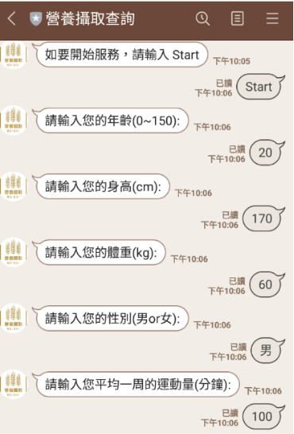
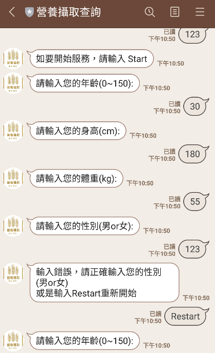
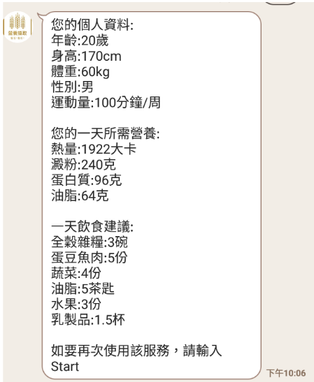

# LINE_CHAT_BOT 一天所需營養  

  

### 功能:查詢一天所需營養量  
使用方式:  
	輸入Start後，按照提示依序輸入年齡、身高、體重、性別、每周運動量  
	輸入過程中若有輸入資料錯誤，可輸入Restart重新開始  
  
  

獲得結果:  
	1.剛輸入的所有個人資料  
	2.一天所需的熱量、營養量  
	3.將第2點換算成各類食品的份量  
  
	
### fsm 圖  
  

### 參考資料

